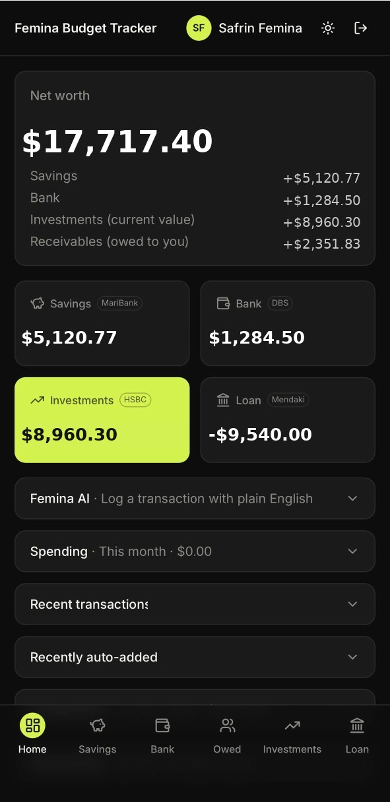
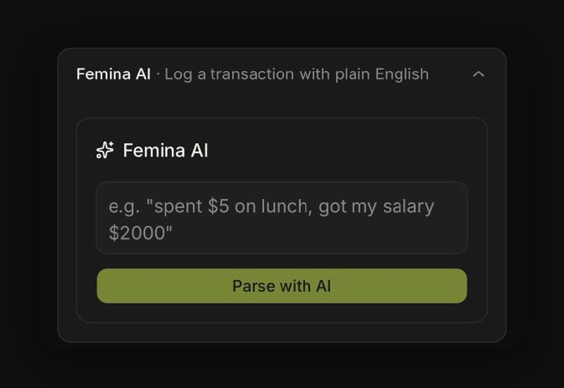
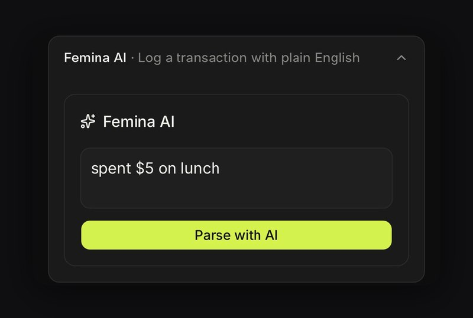
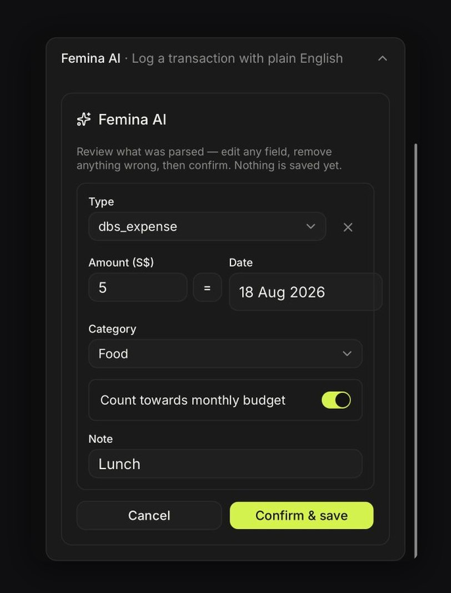
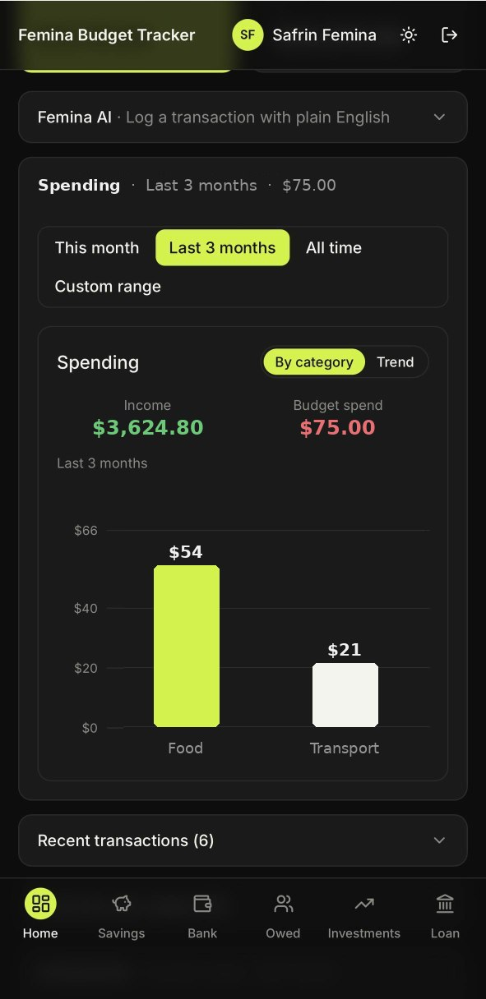
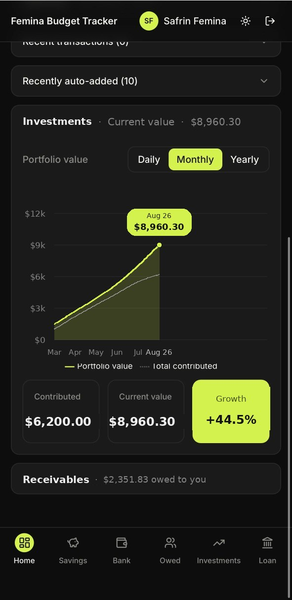
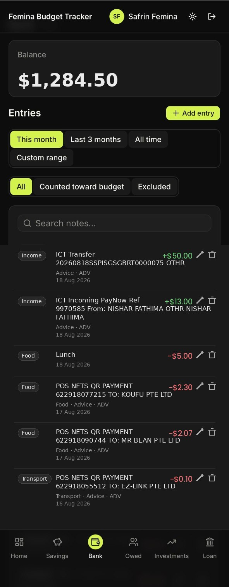

# Femina Budget Tracker

A personal finance dashboard for tracking savings, day-to-day spending, investments,
money owed to you, and a loan — all in one place, with natural-language transaction
entry powered by AI. Built as a single-user, installable Progressive Web App for
managing my own finances on the go.

## Table of contents

- [Live demo](#live-demo)
- [Screenshots](#screenshots)
- [Key features](#key-features)
- [Tech stack](#tech-stack)
- [Architecture highlights](#architecture-highlights)
- [Local setup](#local-setup)
- [Project structure](#project-structure)
- [Deploying](#deploying)

## Live demo

**[budget-tracker-dusky-theta.vercel.app](https://budget-tracker-dusky-theta.vercel.app)**

> Note: this is a single-user app with no public sign-up — the live demo showcases
> the UI/UX but isn't intended for others to create accounts.

## Screenshots

### Dashboard
A single view of net worth across savings, bank, investments, and receivables.



### Femina AI — log transactions in plain English
Type a transaction naturally (e.g. "spent $5 on lunch") and Femina AI parses it
into a structured entry — type, amount, date, category — for you to review
before saving.

<p float="left">
  
  
  
</p>

### Spending insights
Breaks down spending by category over custom time ranges.



### Investment tracking
Visualizes portfolio growth against total contributions over time.



### Bank feed
Transaction-level detail synced from bank statements, with budget tagging.



## Key features

- **Multi-account tracking** — five accounts in one net worth view: Savings, Bank
  (daily spending), Investments, Receivables (money others owe you), and a Loan,
  each with its own dedicated page and entry log.
- **Categorized spending with budget opt-out** — expenses are tagged by category
  (Food, Transport, Shopping, Bills, Other) with a per-entry toggle to exclude
  one-off purchases from monthly budget totals without affecting the account
  balance.
- **Custom date range filtering and search** — This month / Last 3 months / All
  time / a custom From–To range on every account's entry list, plus case-insensitive
  note (and person, for Receivables) search.
- **Natural-language transaction entry ("Femina AI")** — type something like
  *"spent $12 on lunch, got my salary $2000"* and it's parsed server-side by the
  Google Gemini API into one or more structured entries, including evaluating
  simple math expressions in the amount (e.g. *"$45/3 split with roommate"*). A
  human-in-the-loop review screen lets you edit or remove anything before
  confirming — nothing is ever saved automatically.
- **Automated email-based transaction ingestion** — a Google Apps Script watches
  Gmail for DBS and MariBank transaction alert emails and forwards each one to a
  dedicated, unattended API route, which uses the sender's domain (not free text)
  to identify the account with certainty, then Gemini to extract the transaction
  itself. Known non-transactional notifications from the same senders (e.g. an
  "account alert preferences updated" confirmation) are recognized by subject and
  skipped before ever reaching Gemini, rather than logged as failures. Every
  attempt — success, genuine failure, or recognized skip — is written to an audit
  log, deduplicated by message ID so a re-forwarded email is a safe no-op.
- **Import issues tracking** — a dashboard card surfaces any email that
  genuinely failed to import (unrecognized sender, a parsing miss, a transient
  API error) with the account, reason, and a preview of the original email, so a
  missed transaction is never silently lost — dismiss once reviewed, or add it by
  hand. Collapses to a single "N import issues" line when there's something to
  review, and disappears entirely when there isn't.
- **Actionable reminders** — banners for the monthly loan repayment and portfolio
  valuation check-ins, with the confirm/log flow available inline on the dashboard
  itself, no need to navigate to the account page first.
- **Investments growth chart** — portfolio value plotted against total
  contributed over time, switchable between daily/monthly/yearly granularity,
  with contributed/current-value/growth% stat tiles kept in sync with the chart.
- **Dark/light theme** — a manual toggle, persisted locally, with a dedicated
  color palette per mode (not just an inverted filter) and a flash-free page load.
- **Installable PWA** — a hand-rolled manifest, service worker, and icon set (no
  `next-pwa`), installable to a phone home screen with full-screen, native-feeling
  launch behavior.
- **Responsive, mobile-first dashboard** — the mobile dashboard leads with only
  the essentials (net worth, account cards, due reminders) and tucks secondary
  content into collapsible sections, so the first screen is scannable without a
  long scroll. High-volume lists (recent transactions, auto-imported entries)
  collapse to a single count by default on both mobile and desktop, and group
  their contents by date (Today, Yesterday, This week, then actual dates) once
  expanded, rather than one long undifferentiated feed.

## Tech stack

- **[Next.js](https://nextjs.org/)** (App Router, TypeScript, Server Actions)
- **[Tailwind CSS](https://tailwindcss.com/)** + **[shadcn/ui](https://ui.shadcn.com/)** (built on Base UI)
- **[Recharts](https://recharts.org/)** for the spending and portfolio-value charts
- **[Supabase](https://supabase.com/)** — Postgres, Auth, and Row Level Security
- **[Google Gemini API](https://ai.google.dev/)** for free-text transaction parsing,
  both interactive (Femina AI) and unattended (email ingestion)
- **Google Apps Script** — watches Gmail and forwards bank alert emails to the app
- **[Vercel](https://vercel.com/)** for hosting/deployment
- **GitHub Actions** for CI (build verification on every push)

## Architecture highlights

**Security model.** Every table is scoped to the authenticated user via Postgres
Row Level Security policies (`auth.uid() = user_id` on every row), so data
isolation is enforced at the database layer, not just in application code. The
proxy/middleware layer (`proxy.ts`) only does an optimistic redirect for
unauthenticated requests — it's a UX nicety, not the security boundary. Every
Server Action independently re-verifies the session before touching the
database, so there's no path to reading or writing another user's data even if a
route-level check were somehow bypassed.

**AI integration pattern.** The Gemini API key is read only inside Server Actions
(`actions/quick-add.ts` → `lib/gemini.ts`, guarded with `import "server-only"`),
so it's never bundled into client-side JavaScript or exposed to the browser. The
model is constrained to a structured JSON response schema rather than free-form
text, and its output is treated as a **draft**, not a write: the parsed entries
populate an editable review screen, and nothing reaches the database until the
user explicitly confirms — the same principle applied to the monthly reminder
banners, which never insert a record on your behalf, only after you confirm.

**Unattended ingestion pipeline.** `POST /api/ingest-email` has no browser
session to authenticate with, so it uses a single shared secret (`INGEST_SECRET`,
compared with a constant-time check) instead of Supabase cookies, and writes
through a service-role client scoped to a fixed `INGEST_USER_ID` rather than a
derived session user. Classification happens in a deliberate order: sender
domain first (the one thing that can't be spoofed by the email's own content),
then a small evidence-based check for known non-transactional subjects — both
before Gemini is ever called — and only then does Gemini get asked to extract
amount/category/date, constrained to the response types valid for the
already-known account. Every outcome is written to an append-only audit log
(`email_ingest_log`), keyed uniquely on `(user_id, message_id)` so Apps Script
re-sending the same email is a safe no-op rather than a duplicate entry.

## Local setup

**Prerequisites:** Node.js 20.9+, a [Supabase](https://supabase.com/) project.

```bash
git clone <this-repo-url>
cd Budget-Tracker
npm install
```

**1. Set up Supabase:**

- In the Supabase dashboard, open **SQL Editor → New query**, paste in the
  contents of `supabase/schema.sql`, and run it. This creates every table and
  its Row Level Security policies.
- Go to **Authentication → Users → Add user** and create the one account you'll
  sign in with (email + password) — there's no public sign-up page by design.

**2. Configure environment variables:**

```bash
cp .env.example .env.local
```

Fill in `.env.local` with:

| Variable | Purpose |
|---|---|
| `NEXT_PUBLIC_SUPABASE_URL` | Your Supabase project URL |
| `NEXT_PUBLIC_SUPABASE_ANON_KEY` | Your Supabase anon/public key |
| `GEMINI_API_KEY` | Google Gemini API key (free tier) — powers Femina AI. Optional: without it, the rest of the app works normally and Femina AI just shows an error. |
| `SUPABASE_SERVICE_ROLE_KEY` | From **Project Settings → API**. Bypasses RLS — powers `/api/ingest-email` only, which has no session to authenticate through RLS with. Optional: only needed for automated email ingestion. |
| `INGEST_USER_ID` | Your own user UUID (**Authentication → Users**). All auto-imported entries are written to this user. Optional, same as above. |
| `INGEST_SECRET` | Any long random string (e.g. `openssl rand -hex 32`). The Apps Script sender must send this back in an `x-ingest-secret` header. Optional, same as above. |

(An optional `GEMINI_MODEL` variable is also supported if you want to pin a
specific model instead of the default alias — see `.env.example` for details.)

**3. (Optional) Set up automated email ingestion:**

The Gmail-watching side lives outside this repo, in a standalone
[Google Apps Script](https://script.google.com/) bound to the Gmail account
that receives your bank alert emails. It searches for messages from the
configured bank sender addresses and POSTs each one to
`/api/ingest-email` with the `x-ingest-secret` header set to your
`INGEST_SECRET`, on a time-driven trigger (e.g. every 15 minutes). Skip this
step if you only want manual/Femina AI entry — every other feature works
without it.

**4. Run the dev server:**

```bash
npm run dev
```

Open [http://localhost:3000](http://localhost:3000) and sign in with the user
you created in Supabase.

## Project structure

```
app/
  (app)/          Authenticated routes — dashboard + one page per account —
                   behind app/(app)/layout.tsx, which enforces auth and
                   renders the header/bottom nav
  login/           Sign-in page
  api/
    ingest-email/  Unattended endpoint for the Apps Script email pipeline —
                   shared-secret auth, no session
components/        Shared UI: shadcn/ui primitives (components/ui/), charts,
                   forms, and page-level composed components
lib/               Supabase client setup, shared types, formatting/date
                   utilities, the calculator expression parser, and the
                   Gemini API wrapper
actions/           Server Actions — one file per account, plus auth,
                   quick-add, and the Import Issues dismiss action — each
                   re-verifying the session before touching the database
supabase/
  schema.sql       Full database schema and Row Level Security policies
proxy.ts           Refreshes the Supabase session cookie and redirects
                   unauthenticated requests to /login (an optimistic check
                   only — RLS and per-action auth are the real boundary)
scripts/
  generate-icons.mjs  Generates the PWA icon set from vector shapes
```

## Deploying

1. Push this repo to GitHub (or GitLab/Bitbucket).
2. In Vercel, **Add New → Project**, and import the repo — Next.js is
   auto-detected.
3. Add the environment variables from [Local setup](#local-setup) under
   **Project Settings → Environment Variables** (Production, Preview, and
   Development).
4. Deploy.

Once deployed, it can be installed on an iPhone via Safari → Share → **Add to
Home Screen**, launching full-screen with its own icon.
